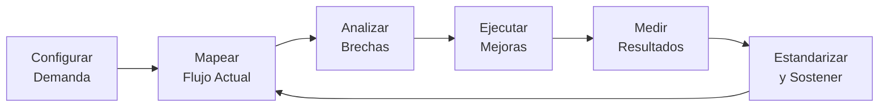

# 📘 NexIA VSM — Manual de Usuario

> **Versión**: 1.0.0  
> **Aplicación**: NexIA Value Stream Mapping  
> **Propósito**: Plataforma integral de Mapeo de Flujo de Valor — del diagnóstico a la mejora continua.

---

## Tabla de Contenidos

1. [Introducción](#1-introducción)
2. [Inicio Rápido](#2-inicio-rápido)
3. [Navegación General](#3-navegación-general)
4. [Módulo 0: Inicio — Gestión de Proyectos](#4-módulo-0-inicio--gestión-de-proyectos)
5. [Módulo 1: Configuración de Demanda](#5-módulo-1-configuración-de-demanda)
6. [Módulo 2: Lienzo de Mapeo VSM](#6-módulo-2-lienzo-de-mapeo-vsm)
7. [Módulo 3: Análisis Avanzado](#7-módulo-3-análisis-avanzado)
8. [Módulo 4: Ejecución y Gestión Lean](#8-módulo-4-ejecución-y-gestión-lean)
9. [Módulo 5: Hub de Integraciones](#9-módulo-5-hub-de-integraciones)
10. [Módulo 6: Dashboards 360°](#10-módulo-6-dashboards-360)
11. [Módulo 7: Estandarización y Mejora Continua](#11-módulo-7-estandarización-y-mejora-continua)
12. [Persistencia de Datos](#12-persistencia-de-datos)
13. [Glosario Lean](#13-glosario-lean)

---

## 1. Introducción

NexIA VSM transforma el Mapeo de Flujo de Valor de un ejercicio estático de dibujo en un **sistema vivo, analítico y accionable** de mejora organizacional. La aplicación cubre todo el ciclo de vida del VSM:



### ¿Para quién es esta aplicación?

| Rol | Uso principal |
|-----|---------------|
| **Ingeniero de Mejora Continua** | Mapear procesos, simular escenarios, gestionar Kaizen |
| **Gerente de Planta** | Dashboards 360°, seguimiento de KPIs, auditorías |
| **Líder de Equipo** | Ejecución de tareas Kaizen, matriz de habilidades |
| **Consultor Lean** | Diagnóstico ADKAR, análisis de resistencia al cambio |

---

## 2. Inicio Rápido

### Acceder a la aplicación

```bash
cd /Users/juangarces/Nexia/Aplicaciones/NexIA_VSM
npm run dev
# Abrir http://localhost:5173/
```

### Primeros pasos (5 minutos)

1. **Explorar el proyecto demo**: La app incluye un proyecto precargado ("Línea de Ensamble — Motor Eléctrico") con datos realistas de 6 estaciones.
2. **Revisar Configuración** (⚙️): Ver cómo se calcula el Takt Time.
3. **Explorar el Lienzo** (🗺️): Ver los bloques de proceso con sus Data Boxes.
4. **Crear tu proyecto**: Clic en **"+ Nuevo Proyecto"** desde Inicio.

---

## 3. Navegación General

La barra lateral izquierda contiene los 8 módulos de la aplicación:

| Icono | Módulo | Descripción |
|-------|--------|-------------|
| 🏠 | **Inicio** | Dashboard principal y gestión de proyectos |
| ⚙️ | **Configuración** | Demanda del cliente y Takt Time |
| 🗺️ | **Lienzo VSM** | Mapeo visual del flujo de valor |
| 🔬 | **Análisis** | Diagnóstico ADKAR y Sombra Digital |
| 🚀 | **Ejecución** | Tablero Kaizen y matriz de habilidades |
| 🔗 | **Integraciones** | Conexión con sistemas externos |
| 📊 | **Dashboards** | Métricas operativas, ambientales y sociales |
| 📋 | **Estándares** | SOPs, condiciones objetivo y auditorías |

> [!TIP]
> El indicador verde junto al nombre del módulo muestra la página activa. Los datos se guardan automáticamente en el navegador.

---

## 4. Módulo 0: Inicio — Gestión de Proyectos

### Pantalla principal

La página de Inicio muestra:

- **KPIs rápidos** del proyecto activo: Takt Time, Lead Time, número de pasos, PCE
- **Tarjetas de proyecto** con indicador del proyecto activo
- **Grid de módulos** con acceso rápido a cada sección

### Crear un nuevo proyecto

1. Clic en **"+ Nuevo Proyecto"**
2. Ingresa el nombre del proyecto (ej: "Línea de Soldadura A")
3. Clic en **"Crear Proyecto"**

El nuevo proyecto se creará con valores predeterminados:
- Demanda: 100 unidades/día
- 1 turno de 8 horas
- Sin pasos de proceso (listos para agregar)

### Cambiar de proyecto activo

Haz clic en cualquier tarjeta de proyecto para activarla. El punto verde indica cuál es el proyecto activo. **Todos los demás módulos trabajan sobre el proyecto activo.**

---

## 5. Módulo 1: Configuración de Demanda

### Propósito

Define los parámetros fundamentales que determinan el **ritmo de producción requerido** (Takt Time).

### Secciones

#### 📦 Demanda del Cliente

| Campo | Descripción | Ejemplo |
|-------|-------------|---------|
| **Cantidad Demandada** | Unidades que el cliente requiere | 120 |
| **Período** | Frecuencia de la demanda (Día/Semana/Mes) | Por Día |

La **demanda efectiva** se muestra automáticamente debajo del formulario.

#### ⏱️ Tiempo de Trabajo Disponible

| Campo | Descripción | Ejemplo |
|-------|-------------|---------|
| **Turnos por Día** | Número de turnos de trabajo | 2 |
| **Horas por Turno** | Duración de cada turno | 8 |
| **Descansos (min)** | Tiempo total de descanso por día | 60 |
| **Reuniones (min)** | Tiempo dedicado a reuniones diarias | 15 |

El cálculo muestra: **Total Bruto** − **Deducciones** = **Disponible**

#### Takt Time

La tarjeta principal muestra el Takt Time calculado automáticamente:

```
Takt Time = Tiempo Disponible / Demanda
```

**Ejemplo**: Con 885 min disponibles y 120 unidades → **Takt = 7.4 min/unidad**

> [!IMPORTANT]
> El Takt Time es la referencia central de toda la aplicación. Se usa en el lienzo para identificar cuellos de botella y en la simulación para evaluar escenarios.

---

## 6. Módulo 2: Lienzo de Mapeo VSM

### Propósito

El corazón de la aplicación. Construye visualmente el mapa del flujo de valor con bloques de proceso, triángulos de inventario y línea de tiempo.

### Vista del flujo

El flujo se muestra de izquierda a derecha:

```
🏭 Proveedor → [Inventario] → Paso 1 → [Inventario] → Paso 2 → ... → 👤 Cliente
```

#### Elementos visuales

| Elemento | Representación | Significado |
|----------|---------------|-------------|
| **Bloque de Proceso** | Rectángulo con Data Box | Estación de trabajo |
| **Triángulo de Inventario** | ▲ amarillo | WIP entre estaciones |
| **Indicador Rojo** 🔴 | En el bloque | Cuello de botella (C/T > Takt) |
| **Flechas →** | Entre bloques | Dirección del flujo |

#### Toggle Estado Actual / Futuro

Usa los botones **"Estado Actual"** y **"Estado Futuro"** para alternar entre vistas.

### Agregar un paso de proceso

1. Clic en **"+ Agregar Paso"**
2. Completa el formulario de **Data Box**:

| Campo | Abreviación | Unidad | Descripción |
|-------|-------------|--------|-------------|
| **Nombre de la Estación** | — | Texto | Nombre descriptivo |
| **Tiempo de Ciclo** | C/T | Segundos | Tiempo para procesar 1 unidad |
| **Tiempo de Cambio** | C/O | Segundos | Changeover / setup |
| **Calidad** | %C&A | 0–1 | First Pass Yield (ej: 0.95 = 95%) |
| **Uptime** | — | 0–1 | Disponibilidad del equipo |
| **Nº Operadores** | Ops | Entero | Personas asignadas |
| **Inventario** | — | Unidades | WIP antes de este paso |
| **Tiempo de Espera** | — | Segundos | Espera antes de procesar |
| **Notas** | — | Texto | Observaciones libres |

3. Clic en **"Guardar"**

### Editar o eliminar un paso

- **Editar**: Clic sobre cualquier bloque de proceso en el mapa
- **Eliminar**: Dentro del modal de edición, clic en **"Eliminar"** (botón rojo)

### Línea de Tiempo

Debajo del mapa aparece la línea de tiempo con:
- Segmentos **verdes** (VA = Valor Agregado): tiempos de ciclo
- Segmentos **amarillos** (Espera): tiempos entre estaciones

**Totales mostrados**: Lead Time Total, Tiempo de Proceso, Tiempo de Espera, PCE

### Gráfica Ciclo vs Takt

Un gráfico de barras compara el **tiempo de ciclo efectivo** (C/T ÷ Operadores) de cada estación contra el Takt Time:
- 🟢 **Verde**: Dentro del Takt
- 🟡 **Amarillo**: Cerca del límite (>85% del Takt)
- 🔴 **Rojo**: Excede el Takt (cuello de botella)

---

## 7. Módulo 3: Análisis Avanzado

### Pestaña 1: 🧠 ADKAR — Diagnóstico de Resistencia al Cambio

El modelo ADKAR evalúa la preparación organizacional para el cambio:

| Dimensión | Pregunta clave |
|-----------|---------------|
| **Conciencia** (Awareness) | ¿El equipo entiende POR QUÉ se necesita el cambio? |
| **Deseo** (Desire) | ¿El equipo QUIERE participar en el cambio? |
| **Conocimiento** (Knowledge) | ¿El equipo SABE cómo cambiar? |
| **Habilidad** (Ability) | ¿El equipo PUEDE implementar el cambio? |
| **Refuerzo** (Reinforcement) | ¿Hay mecanismos para SOSTENER el cambio? |

#### Cómo usarlo

1. Ajusta los **sliders** de 1 a 5 para cada dimensión
2. El **gráfico radar** muestra la forma del perfil ADKAR
3. La tarjeta de **Resistencia** clasifica el tipo:

| Tipo | Promedio | Descripción |
|------|----------|-------------|
| 🟢 Neutral | ≥ 3 | Equipo receptivo |
| 🟠 Encubierta | ≥ 3 pero una dimensión < 2 | Resistencia oculta |
| 🟡 Pasiva | 2–3 | Falta de entusiasmo |
| 🔴 Activa | < 2 | Oposición abierta |

4. La **Recomendación** sugiere acciones basadas en la dimensión más débil

### Pestaña 2: 🌐 Sombra Digital — Simulación de Escenarios

Permite explorar **"¿qué pasaría si...?"** sin modificar los datos reales.

#### Cómo usarlo

1. La tabla muestra todos los pasos de proceso con sus valores actuales
2. Modifica los campos **C/T Simulado**, **C/O Simulado**, y **Espera** para crear un escenario
3. Las **4 tarjetas comparativas** muestran el impacto:
   - Lead Time actual → simulado
   - Tiempo de Proceso actual → simulado
   - PCE actual → simulado
   - Cuello de Botella actual → simulado
4. Valores en **verde** indican mejora, en **amarillo** neutral o peor
5. La **gráfica de barras** compara los ciclos actuales vs. simulados
6. Clic en **"Resetear"** para borrar los cambios simulados

> [!TIP]
> Usa la simulación para justificar inversiones: "Si reducimos el C/O de Bobinado de 40 a 20 min, el Lead Time baja de 27.5 a 22 hrs."

---

## 8. Módulo 4: Ejecución y Gestión Lean

### Pestaña 1: ⚡ Kaizen — Tablero de Eventos

Un **tablero Kanban** de tres columnas para gestionar iniciativas de mejora:

| Columna | Estados |
|---------|---------|
| **Por Hacer** | Eventos identificados pero no iniciados |
| **En Progreso** | Eventos actualmente en ejecución |
| **Completado** | Eventos terminados |

#### Crear un evento Kaizen

1. Clic en **"+ Evento Kaizen"**
2. Completa el formulario:
   - **Título**: Descripción breve de la mejora
   - **Prioridad**: Alta / Media / Baja
   - **Responsable**: Persona asignada
   - **Fecha Límite**: Deadline
3. Clic en **"Crear"**

#### Gestionar tarjetas

- **Mover entre columnas**: Usa los botones **←** y **→** en cada tarjeta
- **Eliminar**: Botón **✕** en rojo
- Las tarjetas muestran bordes de color según prioridad:
  - 🔴 Alta | 🟡 Media | 🟢 Baja

### Pestaña 2: 🗓️ Roadmap — Plan de Implementación

Muestra un plan estructurado en **3 fases** que se alimenta de los eventos Kaizen:

| Fase | Enfoque | Duración | Kaizen Asociados |
|------|---------|----------|------------------|
| **Fase 1: Estabilización** | Reducir variabilidad en cuellos de botella | 4–6 sem. | Prioridad **Alta** |
| **Fase 2: Flujo Continuo** | Pull, FIFO, reducción WIP | 6–8 sem. | Prioridad **Media** |
| **Fase 3: Optimización** | Ajustar al Takt, capacitación cruzada | 8–12 sem. | Prioridad **Baja** |

### Pestaña 3: 🎯 Habilidades — Matriz de Capacitación

Una **matriz Operador × Tarea** con niveles de competencia de 0 a 4.

| Nivel | Etiqueta | Color |
|-------|----------|-------|
| 0 | Sin entrenar | Gris |
| 1 | Aprendiz | Rojo |
| 2 | Capaz | Amarillo |
| 3 | Competente | Verde |
| 4 | Experto | Teal |

#### Cómo usarlo

1. **Agregar operador**: Clic en **"+ Operador"** → ingresa nombre
2. **Agregar tarea**: Clic en **"+ Tarea"** → ingresa nombre
3. **Cambiar nivel**: Clic sobre la celda de la matriz (cicla 0→1→2→3→4→0)

---

## 9. Módulo 5: Hub de Integraciones

### Propósito

Configura conexiones con sistemas externos. En esta versión, las **conexiones son simuladas** pero la interfaz captura toda la configuración para una integración real.

### Categorías

#### 🏭 Manufactura

| Sistema | Uso | Campo |
|---------|-----|-------|
| **SCADA / PLC** | Métricas en tiempo real | URL endpoint WebSocket |
| **ERP / MRP** | Sincronizar demanda e inventarios | URL endpoint REST |
| **Sensores IoT** | Temperatura, vibración, consumo | Broker MQTT |

#### 💻 Software & TI

| Sistema | Uso | Campos |
|---------|-----|--------|
| **Jira** | Ciclo de desarrollo | API Key + Proyecto |
| **GitLab** | Lead time de MRs, MTTR | Token + Proyecto ID |
| **ServiceNow** | Gestión de incidentes | API Key + Instancia |

### Cómo configurar

1. Clic en **"Inactivo"** para activar la integración
2. Completa los campos de configuración
3. Clic en **"🔌 Probar Conexión"** para simular la conexión
4. El indicador de estado mostrará: 🟢 Conectado | 🔴 Error | ⚫ Desconectado

---

## 10. Módulo 6: Dashboards 360°

### Pestaña 1: ⚙️ Operativas

#### KPIs principales (automáticos desde el Lienzo)

| Métrica | Fórmula | Significado |
|---------|---------|-------------|
| **Lead Time** | Σ(C/T + Espera) | Tiempo total puerta a puerta |
| **Tiempo Proceso** | Σ(C/T) | Solo valor agregado |
| **PCE** | Proc / Lead × 100 | Eficiencia del flujo |
| **Takt Time** | Disponible / Demanda | Ritmo requerido |

**Gráficas**: Ciclo vs Cambio, Calidad %, Inventario WIP por estación.

### Pestaña 2: 🌿 Green VSM

Ingresa manualmente los datos de impacto ambiental:

| Métrica | Unidad |
|---------|--------|
| ⚡ Energía | kWh |
| 🌫️ CO₂ | kg |
| 💧 Agua | Litros |
| 🗑️ Residuos | kg |

El **Índice de Sostenibilidad** (0–100) muestra: 🟢 ≥70 | 🟡 40–70 | 🔴 <40

### Pestaña 3: 👥 Social

| Métrica | Tipo | Referencia |
|---------|------|-----------|
| 🛡️ Incidentes Seguridad | Número | 0 = excelente |
| 🦴 Riesgo Ergonómico | Bajo/Medio/Alto | Cualitativo |
| 🔄 Tasa de Rotación | 0–1 | <0.10 = saludable |
| 😊 Bienestar Equipo | 1–5 | ≥4 = positivo |

> [!WARNING]
> Si el bienestar cae por debajo de 3/5, se activa una **Alerta de Burnout** automática.

---

## 11. Módulo 7: Estandarización y Mejora Continua

### Pestaña 1: 📄 SOPs

Documenta procedimientos operativos estándar. Cada SOP incluye: Título, Proceso/Estación, Secuencia de Trabajo, Tiempos, Puntos Clave y Notas de Seguridad.

### Pestaña 2: 🎯 Condiciones Objetivo

Define metas medibles estilo **Toyota Kata** con: Métrica, Valor Actual, Valor Objetivo, Fecha Límite, Responsable y Estado.

Al alcanzar una meta (estado "Alcanzado"), el botón **"🔄 Nuevo Ciclo"** crea automáticamente la siguiente con el valor alcanzado como nuevo punto de partida.

### Pestaña 3: ✅ Auditoría

Checklist de 6 ítems de cumplimiento diario con indicador de porcentaje y recomendación automática:
- 🟢 ≥80%: Excelente cumplimiento
- 🟡 50–79%: Requiere acciones correctivas
- 🔴 <50%: Reunión urgente del equipo de mejora

---

## 12. Persistencia de Datos

| Aspecto | Comportamiento |
|---------|---------------|
| **Guardado** | Automático en cada cambio (localStorage) |
| **Recarga** | Los datos persisten |
| **Otro navegador** | Los datos NO se comparten |
| **Limpieza de caché** | Se pierden los datos |

> [!CAUTION]
> Si limpias los datos del navegador, los proyectos se perderán.

---

## 13. Glosario Lean

| Término | Definición |
|---------|-----------|
| **Takt Time** | Ritmo al que debe producirse para satisfacer la demanda del cliente |
| **Lead Time** | Tiempo total desde entrada de material hasta salida del producto |
| **Cycle Time (C/T)** | Tiempo para completar una unidad en una estación |
| **Changeover (C/O)** | Tiempo de preparación/cambio de modelo |
| **PCE** | Process Cycle Efficiency — % del Lead Time que agrega valor |
| **OEE** | Overall Equipment Effectiveness |
| **WIP** | Work in Process — Inventario entre estaciones |
| **%C&A** | Complete & Accurate — First Pass Yield |
| **ADKAR** | Modelo de gestión del cambio (Prosci) |
| **Kaizen** | Mejora continua incremental |
| **5S** | Metodología de orden y limpieza |
| **Kata** | Patrón de mejora científica de Toyota |
| **FIFO** | First In, First Out |
| **Pull** | Sistema donde el proceso posterior "jala" del anterior |
| **Sombra Digital** | Réplica virtual simplificada para simulación |
| **Green VSM** | Extensión del VSM con métricas ambientales |

---

> **NexIA VSM** — Parte de la suite **Nexia** de aplicaciones Lean.
